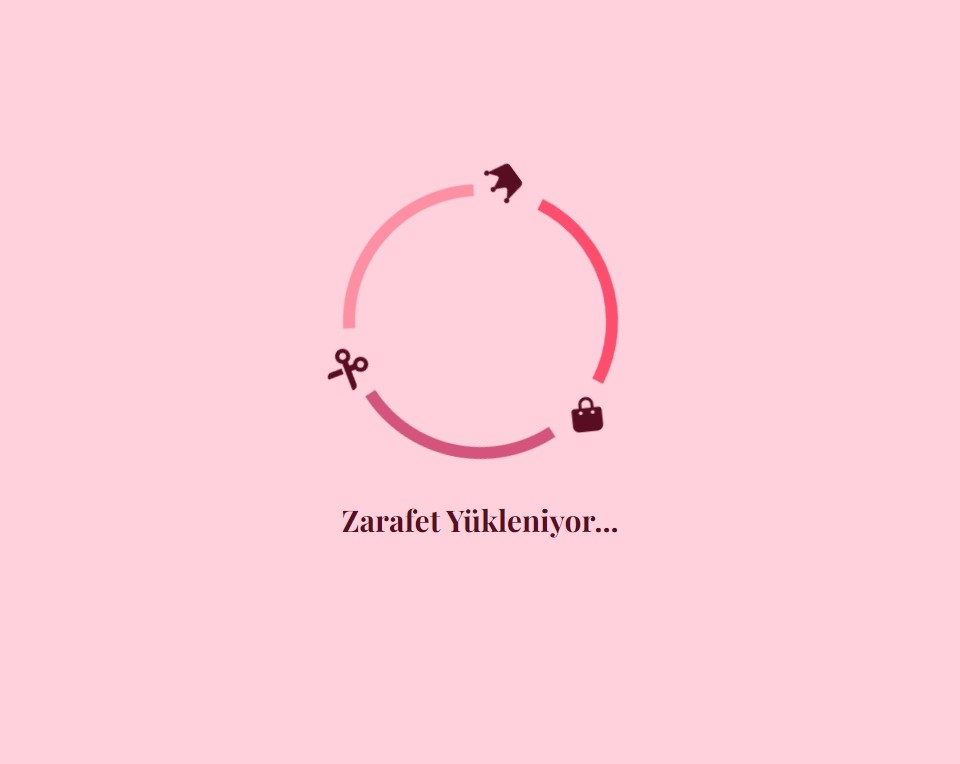
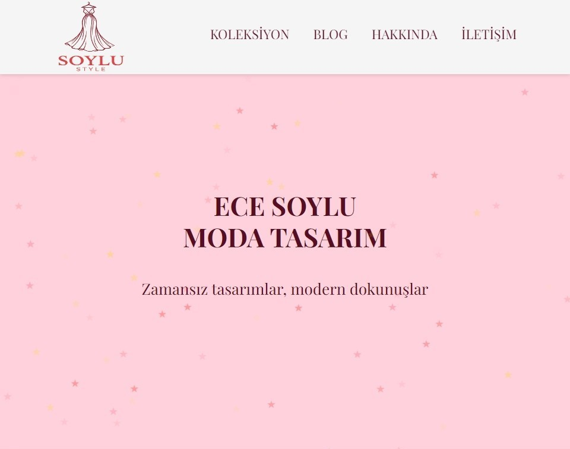
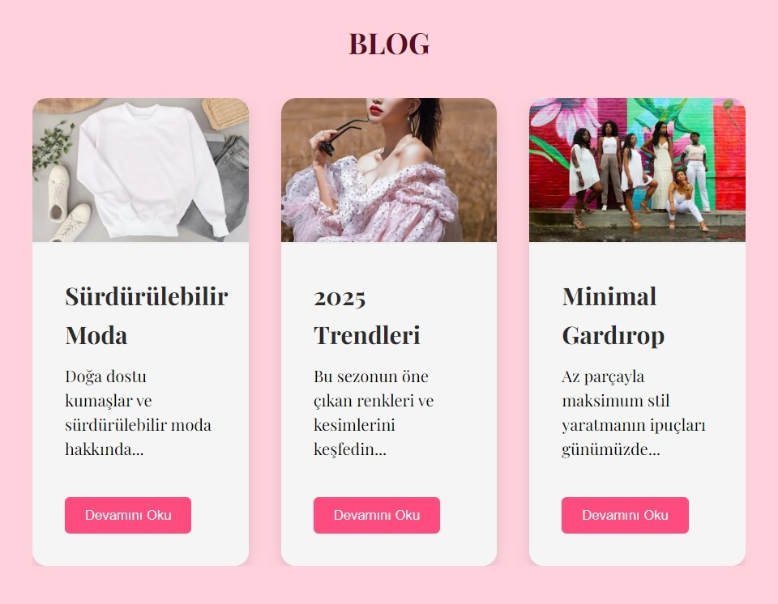
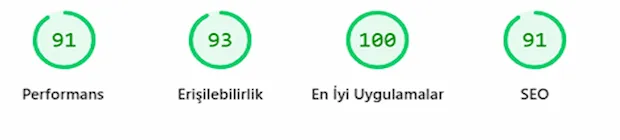
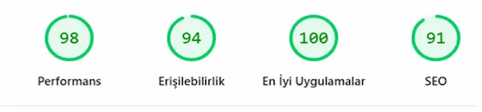
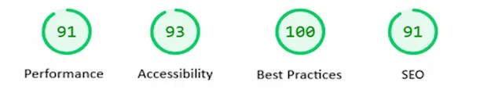
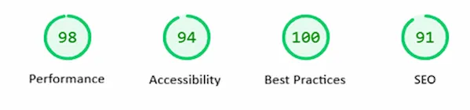

# Soylu Style ✨

Soylu Style, moda tasarımcısı Ece Soylu'nun markasına özel geliştirilmiş kurumsal bir tanıtım sitesidir. Kullanıcı dostu arayüzü ve şık tasarımıyla ziyaretçilere ilham vermeyi hedefler.

## 🚀 Özellikler

- 🌟 **Şık ve minimalist tasarım**
- 🎨 **Özel koleksiyonlar bölümü**
- 📖 **Moda ve tasarım hakkında blog yazıları**
- 📱 **Mobil uyumlu (responsive) tasarım**
- ✨ **Özel yükleme animasyonu**
- ⚡ **WebP formatında optimize edilmiş görseller**

---

## 📸 Ekran Görüntüleri

<div align="center">
  
  &nbsp;
  
  &nbsp;
  
</div>

---

## ⚡ Performans

<div align="center">
  <table>
    <tr>
      <td align="center"><b>📱 Mobil</b></td>
      <td align="center"><b>🖥️ Masaüstü</b></td>
    </tr>
    <tr>
      <td></td>
      <td></td>
    </tr>
  </table>
</div>

---

## 📦 Kurulum

Projeyi klonlayarak yerel ortamınızda çalıştırabilirsiniz.

```sh
git clone https://github.com/begumnarmanli/soylu-style
cd soylu-style
```

Daha sonra `index.html` dosyasını bir tarayıcıda açarak görüntüleyebilirsiniz.

---

## 🛠️ Kullanılan Teknolojiler

- **HTML5** – Yapıyı oluşturmak için
- **CSS3** – Modern ve duyarlı tasarım için
- **JavaScript** – Dinamik içerikler için

---

## 🎯 Geliştirme

Geliştirmeye katkıda bulunmak istiyorsanız, aşağıdaki adımları takip edebilirsiniz:

1. Bu repoyu forklayın 🍴
2. Yeni bir branch oluşturun: `git checkout -b yeni-özellik`
3. Değişikliklerinizi yapın ve commitleyin: `git commit -m 'Yeni özellik eklendi'`
4. Branch'inizi push'layın: `git push origin yeni-özellik`
5. Bir Pull Request (PR) oluşturun 🎉

---

## 🤝 Katkıda Bulunun

Eğer projeye katkı sağlamak isterseniz, PR göndermekten çekinmeyin. Hata bildirimleri ve önerileriniz için GitHub Issues kısmını kullanabilirsiniz.

---

## 📄 Lisans

Bu proje MIT lisansı ile lisanslanmıştır. Daha fazla bilgi için [LICENSE](LICENSE) dosyasına göz atabilirsiniz.

---

<div align="center">
  💖 <b>Desteklemek için projeyi yıldızlamayı unutmayın! ⭐</b>
</div>

# Soylu Style ✨

Soylu Style is a corporate showcase website developed exclusively for fashion designer Ece Soylu's brand. With its user-friendly interface and elegant design, it aims to inspire visitors.

## 🚀 Features

- 🌟 **Elegant and minimalist design**
- 🎨 **Custom collections section**
- 📖 **Blog posts about fashion and design**
- 📱 **Mobile-friendly (responsive) design**
- ✨ **Custom loading animation**
- ⚡ **WebP optimized images**

---

## 📸 Screenshots

<div align="center">
  
  &nbsp;
  
  &nbsp;
  
</div>

---

## ⚡ Performance

<div align="center">
  <table>
    <tr>
      <td align="center"><b>📱 Mobile</b></td>
      <td align="center"><b>🖥️ Desktop</b></td>
    </tr>
    <tr>
      <td></td>
      <td></td>
    </tr>
  </table>
</div>

---

## 📦 Installation

You can clone the project and run it in your local environment.

```sh
git clone https://github.com/begumnarmanli/soylu-style
cd soylu-style
```

Then open the `index.html` file in a browser to view it.

---

## 🛠️ Technologies Used

- **HTML5** – For structure
- **CSS3** – For modern and responsive design
- **JavaScript** – For dynamic content

---

## 🎯 Contributing

If you'd like to contribute to the project, follow these steps:

1. Fork this repository 🍴
2. Create a new branch: `git checkout -b new-feature`
3. Make your changes and commit: `git commit -m 'Added new feature'`
4. Push your branch: `git push origin new-feature`
5. Open a Pull Request 🎉

---

## 🤝 Contribute

Feel free to send PRs if you'd like to contribute. For bug reports and suggestions, please use GitHub Issues.

---

## 📄 License

This project is licensed under the MIT License. See the [LICENSE](LICENSE) file for more details.

---

<div align="center">
  💖 <b>Don't forget to star the project if you liked it! ⭐</b>
</div>